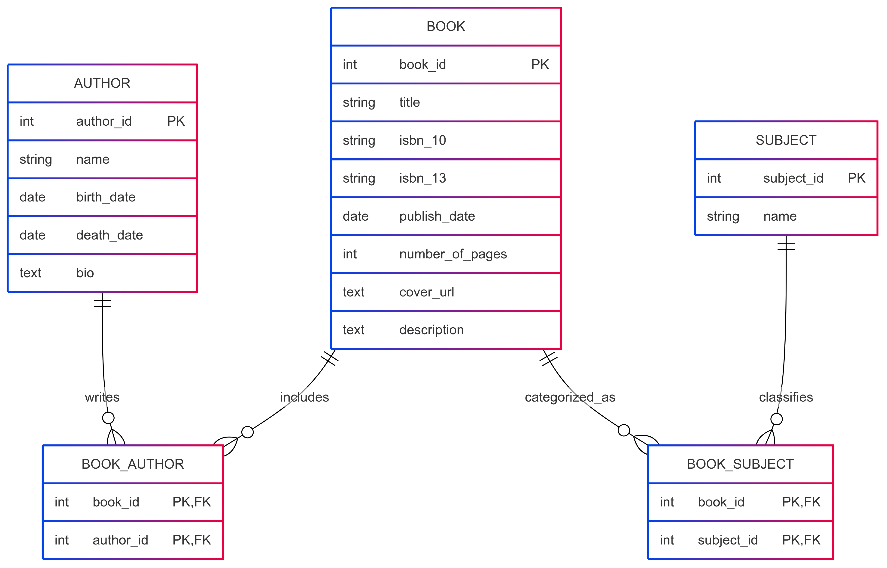

# Book Management System

A modern, intuitive web application for managing a book collection with beautiful visualizations and search capabilities.

## Table of Contents
- [Overview](#overview)
- [Features](#features)
- [Data Model](#data-model)
- [API Endpoints Used](#api-endpoints-used)
- [CRUD Implementation](#crud-implementation)
- [Technical Challenges and Solutions](#technical-challenges-and-solutions)
- [Technologies Used](#technologies-used)
- [Team Members](#team-members)

## Overview

The Book Management System is designed to help users manage book records with ease - like a smart personal library. It provides a modern, intuitive interface for organizing your collection with features for adding, editing, and deleting books, as well as visualizing data and searching for new books.

## Features

- **Modern UI**: Beautiful gradient backgrounds, card-based layouts, and interactive elements
- **Explore Books**: Browse and manage your book collection with a visually appealing interface
- **Data Visualization**: Interactive charts showing insights about your book collection
- **Book Search**: Search for books using the Open Library API
- **Full CRUD Operations**: Create, read, update, and delete books in your collection
- **Responsive Design**: Works on desktop and mobile devices

## Data Model

Our database schema consists of the following main entities:

- **Book**: Stores book information (title, ISBN, publication date, etc.)
- **Author**: Contains author details
- **Subject**: Represents book subjects/categories
- **BookAuthor**: Junction table for the many-to-many relationship between books and authors
- **BookSubject**: Junction table for the many-to-many relationship between books and subjects

### ERD Diagram

## API Endpoints Used

### Internal API Endpoints

Our application implements the following RESTful endpoints for CRUD operations:

- **GET /Explore/Index**: Retrieves all books in the collection
- **GET /Explore/Details/{id}**: Gets detailed information about a specific book
- **GET /Explore/Edit/{id}**: Retrieves a book for editing
- **POST /Explore/Edit/{id}**: Updates a book's information
- **GET /Explore/Delete/{id}**: Retrieves a book for deletion confirmation
- **POST /Explore/Delete/{id}**: Deletes a book from the collection
- **GET /Explore/Create**: Displays form to create a new book
- **POST /Explore/Create**: Adds a new book to the collection

### External API Endpoints

We also integrate with the following external APIs:

- **Open Library Search API**: `https://openlibrary.org/search.json?q={query}` - Used in the Search page to find books
- **Open Library Covers API**: `https://covers.openlibrary.org/b/id/{cover_id}-M.jpg` - Used to display book covers

## CRUD Implementation

Our CRUD operations are implemented using direct SQL queries instead of Entity Framework to avoid infinite loading issues with complex relationships:

### Create
- Books can be created with associated authors and subjects
- Implemented with SQL transactions to ensure data integrity
- Form validation ensures all required fields are provided

### Read
- Books are displayed in a card-based layout on the Explore page
- Detailed view shows all book information including authors and subjects
- Optimized queries retrieve only necessary data to improve performance

### Update
- Edit functionality allows updating all book properties
- Authors and subjects can be added or removed
- Changes are saved using SQL transactions

### Delete
- Confirmation page prevents accidental deletions
- SQL transactions ensure all related records are deleted
- Proper error handling for failed delete operations

## Technical Challenges and Solutions

### Challenge 1: Infinite Loading with Entity Framework
**Problem**: Entity Framework was causing infinite loading issues due to circular references in the object graph when loading books with their related authors and subjects.

**Solution**: Replaced Entity Framework queries with direct SQL queries that precisely control which data is loaded. Implemented proper transaction handling to ensure data integrity.

### Challenge 2: Database Connection Issues
**Problem**: First-time database operations would often time out, requiring users to retry the action.

**Solution**: Implemented connection warmup in the controller constructor and added retry logic with exponential backoff for database operations. Increased the command timeout to accommodate slower connections.

### Challenge 3: CSS @keyframes in Razor Views
**Problem**: CSS @keyframes declarations were causing compilation errors in Razor views due to the @ symbol conflict.

**Solution**: Escaped @ symbols in CSS by doubling them (@@keyframes) to distinguish them from Razor syntax.

### Challenge 4: Modern UI Implementation
**Problem**: Creating a consistent, modern UI across all pages while maintaining functionality.

**Solution**: Implemented a card-based design with gradient backgrounds, hover effects, and consistent styling. Used partial views and shared styles to ensure consistency.

## Technologies Used

- **ASP.NET Core MVC**: Web application framework
- **SQL Database**: Data storage with direct SQL queries, hosted on [SupaBase](https://supabase.com/)
- **JavaScript/jQuery**: Client-side interactivity
- **Bootstrap**: Responsive layout and components
- **Chart.js**: Data visualization
- **Open Library API**: External book data

## Team Members

- **Felix Schaefer**: Created Buttons for CRUD functions. Created documentation for the project. Created Presentation Slidedeck on Canva.
- **Chau Vo**: Created About Us page. Updated CSS files and style of Explore page. Implemented MVC architecture for Home, Data Visual, and About Us page. Deployed web application to Azure.
- **Tra Le**: Created Home page, Data Visualization. Created the Logical Data Model diagram. Added Open library API.
- **Chris Brown**: Created CRUD page and buttons. Adjusted code for CRUD operations. Tested Website and Identified faulty functionality.
